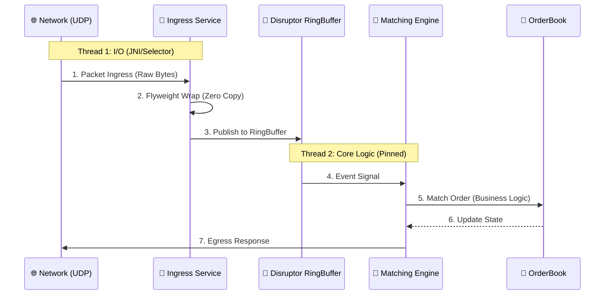

# The Nanosecond Exchange: High-Frequency Engineering in Java

> **Engineering Preface**
>
> In high-frequency trading (HFT), the margin between profit and loss is measured in nanoseconds. While Java is traditionally viewed as a high-throughput, high-latency language unsuitable for HFT, this project demonstrates how to break those constraints.
>
> By applying principles of **Mechanical Sympathy** and rejecting standard Enterprise patterns, this engine achieves **deterministic microsecond latency** and **zero garbage collection** on the HotSpot JVM.

---

## 1. Core Concepts: The Engineering Gap

To understand the architecture, we must first define the gap between "Enterprise Java" and "Low-Latency Java".

### 1.1. Latency vs. Jitter
In web development, we optimize for **Throughput** (requests per second). In HFT, we optimize for **Tail Latency** (the worst-case execution time).
*   **The Problem:** The Java Garbage Collector (GC) introduces meaningful pauses ("Stop-the-World" events). A 1ms pause is acceptable for a web server; for an exchange, it creates a 1,000,000 nanosecond blind spot where the market can move against us.
*   **The Solution:** Eliminate runtime memory allocation entirely. If no objects are created (`new`), the GC has no work to do.

### 1.2. Mechanical Sympathy
Software should be designed to respect the hardware it runs on.
*   **CPU Caches:** Modern CPUs are starved for data. Accessing main RAM takes ~100ns (hundreds of cycles). Accessing L1 Cache takes ~1ns (3-4 cycles).
*   **Data Layout:** Linked structures (like `TreeMap` or `LinkedList`) scatter data across the heap, causing cache misses. Contiguous structures (Arrays, Ring Buffers) allow the CPU to pre-fetch data, maximizing instruction throughput.

---

## 2. Engineering Decisions: Rationale & Trade-offs

A common question is: *"Why not use standard tools like Kafka, TCP, or ConcurrentHashMap?"*
Below is a comparative analysis of our architectural choices versus standard enterprise implementations.

### 2.1. Transport: Aeron vs. TCP/REST

| Feature | Standard Approach (TCP/HTTP) | HFT Approach (Aeron UDP) | The Engineering Rationale |
| :--- | :--- | :--- | :--- |
| **Protocol** | TCP / HTTP 1.1 | reliable UDP (Unicast/IPC) | **Head-of-Line Blocking:** TCP guarantees order and delivery. If Packet 1 is dropped, the OS buffers Packet 2 until Packet 1 is re-sent. In trading, old data is toxic. We prefer to skip lost packets or handle retransmit manually to minimize latency. |
| **Serialization** | JSON / Protobuf | SBE (Simple Binary Encoding) | **Parsing Overhead:** JSON requires scanning strings, allocating objects, and converting types. SBE (and our Flyweights) map fields directly to memory offsets. No parsing, no allocation. |
| **Latency** | 1-10 Milliseconds | 20-50 Microseconds | HTTP headers (`Content-Length`) require string processing. Aeron uses fixed-size binary headers aligned to CPU word sizes. |

### 2.2. Concurrency: LMAX Disruptor vs. Blocking Queues

| Feature | Standard Approach (`ArrayBlockingQueue`) | HFT Approach (LMAX Disruptor) | The Engineering Rationale |
| :--- | :--- | :--- | :--- |
| **Mechanism** | Locks (`ReentrantLock` / `Condition`) | Memory Barriers (`volatile` / `VarHandle`) | **Kernel Arbitration:** When a queue locks, the OS kernel intervenes. This causes a Context Switch (~2-5µs) and flushes the CPU cache. The Disruptor is lock-free; it uses CPU memory fences to coordinate threads without OS intervention. |
| **Memory Layout** | Array of Pointers (References) | Pre-allocated Ring Buffer | **False Sharing:** Standard queues suffer when the Read pointer and Write pointer sit on the same Cache Line (64 bytes). The Disruptor uses padding to isolate these variables, preventing cores from fighting over cache lines. |
| **Throughput** | ~50k ops/sec (contended) | ~6M+ ops/sec | Lock contention kills throughput exponentially with thread count. The Single-Writer principle removes contention entirely. |

### 2.3. Data Structures: Flyweights vs. POJOs

| Feature | Standard Approach (Java Beans/POJO) | HFT Approach (Flyweight Pattern) | The Engineering Rationale |
| :--- | :--- | :--- | :--- |
| **Allocation** | `new Order(price, qty)` | `flyweight.wrap(buffer, offset)` | **GC Pressure:** Every `new` creates garbage. In an exchange processing 100k orders/sec, this triggers frequent GC pauses. Flyweights reuse a single "View" object over a reused byte buffer. |
| **Memory Density** | High (12-16 byte Header per Object) | Minimal (Packed Bytes) | **Cache Locality:** An array of Objects `Order[]` is actually an array of pointers to scattered heap locations. A `ByteBuffer` packs data contiguously (Price, Qty, Side side-by-side), allowing the CPU to load an entire order in one cache line fetch. |

---

## 3. Operational Model: Throughput vs. Latency

### The Traditional Model (The Web Server)
*   **Analogy:** A Restaurant Kitchen.
*   **Scenario:** Request arrival is unpredictable.
*   **Mechanism:** A pool of threads (Waiters) grabbing tasks from a queue.
*   **Cost:** Context switching overhead. When a thread blocks (waits for lock/IO), the OS Kernel must save its state and load another. This costs microseconds and destroys CPU cache locality.

### The Low-Latency Model (The Exchange)
*   **Analogy:** A Formula 1 Pit Crew.
*   **Scenario:** Input is serialized; execution must be immediate.
*   **Mechanism:** **Single-Threaded Pinned Execution**. Key components (the Matching Engine) run on a dedicated CPU core, spinning in a hot loop (`while(true)`).
*   **Benefit:** Zero context switches. The thread never yields the CPU, keeping the L1/L2 caches hot and exclusive to our process.

---

## 4. Architectural Implementation

The system is built as a pipeline of lock-free components communicating via shared memory.



### 4.1. Ingress Layer (`exchange-infra`)
*   **Role:** Protocol translation and normalization.
*   **Technique:** **Flyweight Pattern**. Incoming byte arrays are not deserialized into Java Objects. Instead, a lightweight "View" object is positioned over the raw bytes to read fields (Price, Qty) directly.
*   **Result:** Zero allocation provided the buffer is reused.

### 4.2. Orchestration Layer (LMAX Disruptor)
*   **Role:** Inter-thread communication.
*   **Technique:** **Ring Buffer**. A pre-allocated circular array acts as the conveyor belt between the I/O thread and the Core thread.
*   **Why not `ArrayBlockingQueue`?** Standard queues use locks (`ReentrantLock`), which cause kernel arbitration. The Disruptor uses **Memory Barriers** (`volatile` / `VarHandle`), ensuring safe publication without OS intervention.

### 4.3. Core Logic (`exchange-core`)
*   **Role:** Order Matching and Book Management.
*   **Technique:** **Single-Threaded Determinism**. Because only one thread modifies the Order Book, no concurrency controls (`synchronized`) are needed.
*   **Data Structures:**
    *   **Intrusive Red-Black Tree:** Nodes are not wrapper objects; pointers (`left`, `right`) are embedded in the data object (`PriceLevel`). This improves cache locality and eliminates node allocation.
    *   **Object Pooling:** All `Order` and `PriceLevel` objects are pre-allocated at startup.

---

## 5. Setup and Verification

### Prerequisites
*   Java 21+ (GraalVM or HotSpot)
*   Maven 3.8+
*   (Optional) Linux with `numactl` for CPU pinning.

### Quick Start
1.  **Clean Slate:** Ensure no phantom processes exist.
    ```bash
    ./cleanup.sh
    ```
2.  **Launch Exchange:** Starts the Gateway and Engine.
    ```bash
    ./run_exchange.sh
    ```
3.  **Generate Load:** Run the high-performance load generator.
    ```bash
    ./run_load.sh
    ```

---

## 6. Next Steps for Developers

If you wish to explore the code, start with `SYSTEM_ARCHITECTURE.md` for a deep dive into the specific algorithms used for the Order Book and Matching Logic.

*   **Key Class:** `com.nanosecond.core.RedBlackTree` - An educational implementation of an Intrusive Tree.
*   **Key Class:** `com.nanosecond.infra.AeronIngress` - High-performance UDP handling.
