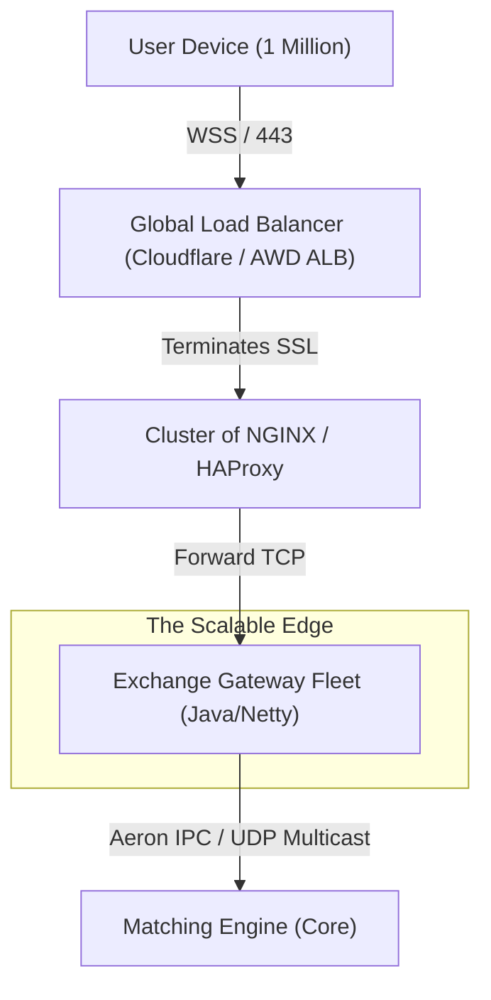

# Engineering RFC: Scalability & Protocol Strategy
**Topic:** Handling 1 Million Concurrent Connections (C1M)
**Date:** Jan 31, 2026

---

## 1. The Challenge: The "C1M" Problem
The user has raised a critical infrastructure question: *How do we handle 1,000,000 connected users?* 

In our current "Reference Architecture" (v1.0), the **Gateway** is a single Netty process. While Netty is non-blocking and can handle ~10k-50k active connections per node (limited by OS File Descriptors and Ephemeral Ports), it cannot handle 1 million alone.

Running 1 million connections involves:
*   **File Descriptors:** 1M open TCP sockets.
*   **Memory:** Even at 1KB per socket (metadata), that is 1GB of RAM just for *silence*.
*   **SSL Termination:** Decrypting 1M streams is CPU intensive.

---

## 2. Protocol Analysis: WebSockets vs. Server-Sent Events (SSE)

We need to choose the transport protocol for two distinct behaviors:
1.  **Market Data:** Broadcasting price updates (Server -> Client).
2.  **Order Entry:** Sending Buy/Sell commands (Client -> Server).

### Option A: Server-Sent Events (SSE) + REST
SSE is a standard for pushing data over HTTP.
*   **Flow:**
    *   Client opens `GET /stream` (Persistent HTTP connection).
    *   Server pushes text data (`data: { price: 100 }`).
    *   To place an order, Client sends `POST /api/order`.

| 💪 Pros | 🛑 Cons |
| :--- | :--- |
| **Simplicity:** It's just HTTP. Works easily with standard Load Balancers (Nginx). | **Uni-directional:** Clients *cannot* talk back on the SSE connection. |
| **Firewall Friendly:** Uses standard port 443/80. | **Latency Penalty (Order Entry):** Plcaing an order requires a NEW TCP Handshake (or finding an idle Keep-Alive connection) for the `POST` request. This adds **milliseconds** of latency. |
| **Auto-Reconnect:** Browsers handle retries automatically. | **Connection Limit:** Browsers (Chrome/Firefox) limit SSE connections (6 per domain) unless using HTTP/2. |

### Option B: WebSockets (Current Architecture)
WebSockets upgrade a standard HTTP connection into a bi-directional raw TCP pipe.

| 💪 Pros | 🛑 Cons |
| :--- | :--- |
| **Bi-directional:** We send Orders AND receive Data on the *same* wire. | **Stateful:** Load Balancing is harder. Once a connection is glued to Gateway-01, it stays there. |
| **Lowest Latency:** No HTTP headers or handshakes for orders. Just raw frames. | **Firewall Issues:** aggressively restrictive corporate proxies sometimes block `Upgrade: websocket`. |
| **Single Inteface:** The "Trading Connection" concept is cleaner. | **Complexity:** We must handle Pings/Pongs and Reconnection logic manually. |

### 🛑 The Verdict: Why Trading Needs WebSockets
For a **News App** or **Social Feed**, SSE is superior.
For a **Trading Exchange**, **WebSockets** are mandatory.
*   **Reason 1 (Speed):** When a user clicks "BUY", the message must fly instantly. Doing a `POST` request involves sending HTTP headers (`User-Agent`, `Cookie`, `Content-Length`), which wastes bandwidth and cycles. A WebSocket frame is 2 bytes of header.
*   **Reason 2 (Correlation):** If I send an Order ID 123, I expect the "Ack" for Order 123 on the same channel. Splitting them (POST for Order, SSE for Ack) introduces race conditions.

---

## 3. The Scalability Strategy: Architecture for Millions

We cannot serve 1M users from one Java process. We must separate the **Trading Engine** (Stateful, Singleton) from the **Connectivity Layer** (Stateless, Horizontally Scalable).

### 3.1. The "Fan-Out" Architecture

### 3.2. Step-by-Step Implementation Plan
1.  **The Gateway Fleet:** We run **100 instances** of our `exchange-gateway` module.
    *   Each instance handles 10,000 connections.
    *   They are stateless. They just translate JSON <-> Binary.
2.  **Shared Memory (Ingress):** All 100 Gateways write to the *same* Aeron IPC channel (if on one huge machine) or use Aeron UDP Multicast (if distributed).
3.  **Market Data (Egress):** The Matching Engine publishes ONE update. Aeron Multicast broadcasts it to all 100 Gateways simultaneously.
4.  **Separation of Concerns (Read vs Write):**
    *   **Active Traders (Order Entry):** Connect to `trade.exchange.com` (High priority WebSocket fleet).
    *   **Passive Watchers (View Only):** Connect to `stream.exchange.com`. This fleet can arguably use SSE or Long-Polling if needed, but reusing WebSocket infrastructure is often operationally cheaper.

---

## 4. Conclusion & Recommendation

**Q: Are WebSockets the wrong choice?**
**A: No.** For a high-frequency trading platform, they are the *only* performant choice for active traders.

**Q: How do we handle millions?**
**A: Not by changing the protocol, but by changing the topology.**
*   **Today:** 1 Gateway Process.
*   **Tomorrow:** A Fleet of Gateway Processes behind a Load Balancer (Nginx).

**Recommendation:**
Proceed with the WebSocket implementation. It is the industry standard for crypto and FX exchanges (Binance, Coinbase, Kraken all use WebSockets). The scalability limits will be solved by **Horizontal Scaling** of the Gateway layer, not by switching to SSE.
